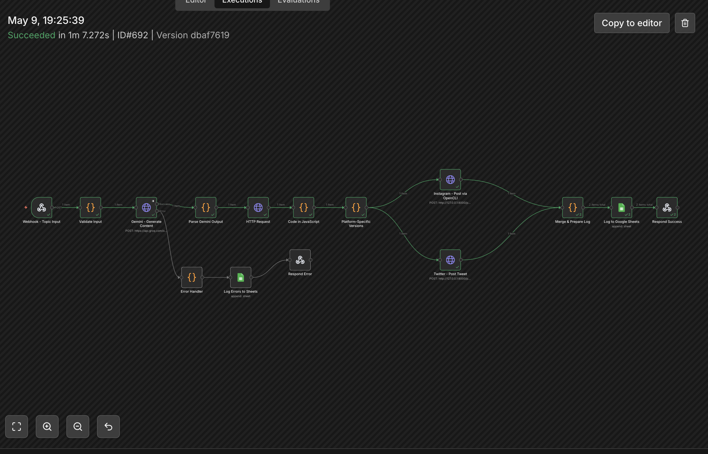
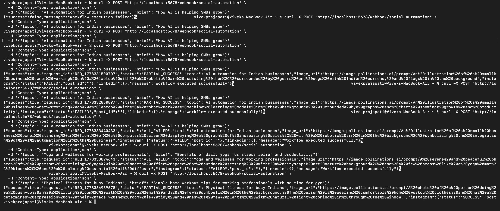
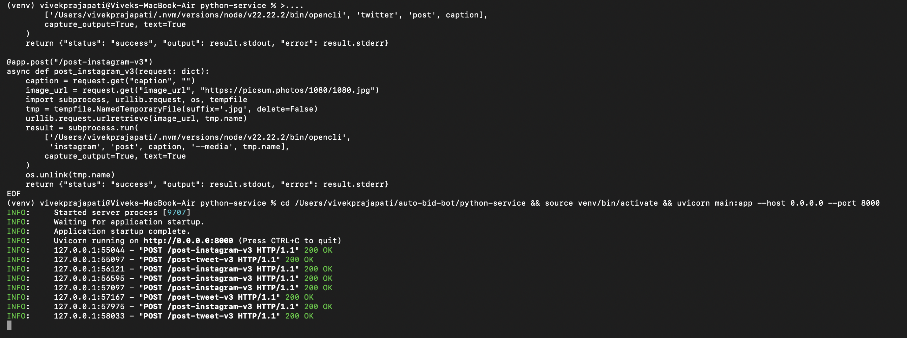

# Shankar Group Social Automation

AI social media content pipeline — auto-generate captions + images → post to Instagram & LinkedIn using n8n, Gemini, and Leonardo AI.

## Architecture

This project is built around an n8n workflow that connects multiple APIs to automate the creation and distribution of social media content.
- **Gemini AI**: Generates creative captions and post content.
- **Leonardo AI**: Generates visually appealing images based on the post content.
- **Instagram & LinkedIn**: Publishes the generated content.
- **Google Sheets**: Retrieves data and tracks the status of generated posts.

## Setup Instructions

1. Clone the repository:
   ```bash
   git clone https://github.com/keviv777/shankar-group-social-automation.git
   cd shankar-group-social-automation
   ```

2. Setup Environment Variables:
   Copy `.env.example` to `.env` and fill in your details:
   ```bash
   cp .env.example .env
   ```

3. Import the Workflow:
   - Open n8n.
   - Go to Workflows -> Import from File.
   - Select `workflow/AI_Social_Media_Final_Clean.json`.
   - Update the credentials in n8n for the respective nodes (Google Sheets, Instagram, LinkedIn, Gemini, Leonardo).

## 📸 Live Demo

### n8n Workflow — Successful Execution (ID#692, 1m 7.272s)


### API Responses — Live Test Results


### FastAPI Server — Running Logs (200 OK)

